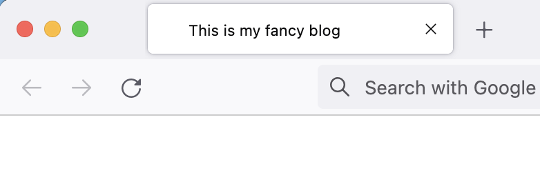
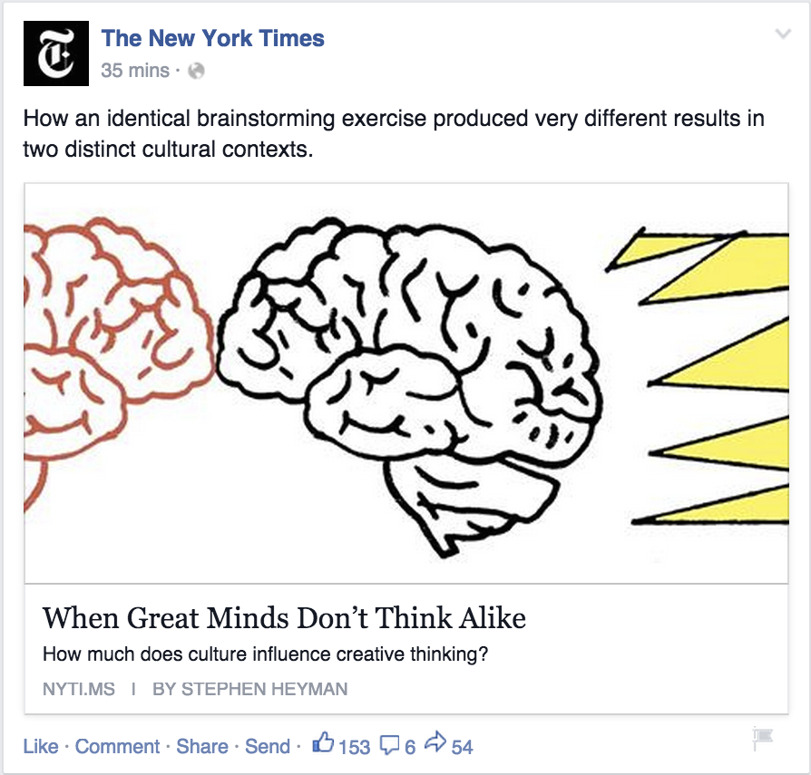
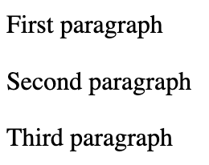
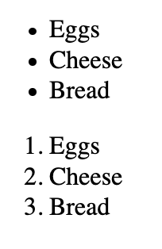

# Add elements to the website

Hello, I'm Alex and we will learn how to add elements to your website.
You will also learn how to add elements to another website.
In few minutes, you will understand how the internet work, and how GitHub let's you open a remote file.

## HTML
Every file of a computer has a different extension: image.png, video.mp4, webpage.html.
Some operational systems hide the extention by default, but it is always there.

Depending on the extention, the operational system chooses which application should open that file.
For example: an image viewer opens PNG files, video editor can open a MP4 file and a browser (e.g. chrome, firefox) open HTML files.

HTML files should always follow this pattern:
```html
<!DOCTYPE html>
<html>
  <!-- Replace this line by html code -->
</html>
```

1. It has to start with `<!DOCTYPE html>`
2. Everything you write should be between `<html>` and `</html>`
3. Everything between `<!--` and `-->` is a code comment, it is ignored by the browsers

### HTML Tag
This piece of code `<html>` is called a tag. HTML language is a collection of those tags, which describe the semantics of the HTML document.
For example, you can tag the title, subtitles, paragraphs, links, images, videos, lists, and many more elements of your webpage.

Tags that can contain other tags inside are delimited by a closing tag, like `</html>`.
Inside `<html>` tag, there should be 2 tags:
- `<head></head>` is a container for elements that aren't displayed
- `<body></body>` is a container for elements that are displayed

### Browser Window Title
One example of element that isn't displayed on the page canvas is the window title
<center></center>

You can customize the window title with a `<title></title>` tag:

```html
<!DOCTYPE html>
<html>
  <head>
    <title>This is my fancy blog</title>
  </head>

  <body>
  </body>
</html>
```

Search engines, like Google, use the title to display the title of pages on the search results.
It's important to use meaninful and simple titles to get more audience.

### Meta Tags
Social networks, like Facebook, use `meta` tags inside the `<head></head>` tag to display pretty links of webpages:
<center></center>

This can be achieved with the following code inside the head tag:
```html
<meta property="og:url"         content="http://www.nytimes.com/2015/02/19/arts/international/when-great-minds-dont-think-alike.html">
<meta property="og:type"        content="article">
<meta property="og:title"       content="When Great Minds Don’t Think Alike">
<meta property="og:description" content="How much does culture influence creative thinking?">
<meta property="og:image"       content="http://static01.nyt.com/images/2015/02/19/arts/international/19iht-btnumbers19A/19iht-btnumbers19A-facebookJumbo-v2.jpg">
```

Notice that since `meta` tags don't have content inside the tag, but within tag attributes. That's why they don't need a closing tag.
But they must have `property` and `content` attributes.

### Favicon
The favicon is the icon displayed by the window title. It can be customized with the following tag, inside the `head` tag.
```html
<link rel="icon" type="image/png" href="icon.png">
```

### Tag Anatomy
```html
<name key="value">content</name>
```
- Every tag has a different name.
- Tags that have content inside, must have a closing tag to delimiter the content.
- Every tag can have additional attributes to modify it's functionality.
- Some tags must have specific attributes, for example: images.

### Image Tag
An image can be displayed on the page body with

```html

```

Images must not have content, but a source attribute for the browser to find the image.

If the filename doesn't specify directories, the file will be searched on the same folder as the HTML file.
To display an image from subfolders use ``.
For parent folders, use ``.

Image tags must have the `src` attribute. Also, it's recommended practice to have the `alt`
attribute to describe the image for visually impaired users that use browser accessbility features.

Since they are displayed, they should be placed withing the `<body></body>` tag.
All the next tags should also be placed within the body tag.

### Body Title Tag
Titles can added to the body with `h1, h2, h3, h4, h5, h6` heading tags, where
- `<h1>This is the main title of the page</h1>`
- `<h2>This is the most important subtitle</h2>`
- `...`
- `<h6>This is the least important subtitle</h6>`

### Paragraph Tag
You should display a paragraph of text with `<p>This is the paragraph content</p>`.
A sequence of paragraphs is broken into lines
<center></center>

### Video Tag
To display a video, use
```html
<video width="320" height="240" controls>
  <source src="movie.mp4" type="video/mp4">
  <source src="movie.webm" type="video/webm">
  Your browser does not support the video tag.
</video>
```

The `<video>` tag contains one or more <source> tags with different video sources.
The browser will choose the first source it supports.
The text inside the `<video></video>` tag will only be displayed in browsers that do not support the `<video>` element.
All modern browsers support MP4 and WEBM video formats.
Like images, and favicons, video filenames are relative to the current folder.

### Lists
You can display an unordered list of elements with
```html
<ul>
  <li>Eggs</li>
  <li>Cheese</li>
  <li>Bread</li>
</ul>
```

Or an ordered list with
```html
<ol>
  <li>Eggs</li>
  <li>Cheese</li>
  <li>Bread</li>
</ol>
```

And they will be displayed like this
<center></center>

### Sections, divisors, headers, articles and main tags
A section of elements related to a single theme, can be grouped together with `<section></section>`.
Grouping elements is useful to organize webpage elements that are semantically related.

According to the [W3 specification](https://html.spec.whatwg.org/multipage/sections.html#the-section-element)
> Examples of sections would be chapters, the various tabbed pages in a tabbed dialog box, or the numbered sections of a thesis.
 A web site's home page could be split into sections for an introduction, news items, and contact information.

Some developers wrongly use the `<div></div>` tag to divide content. This is a bad practice because, according to the [specification](https://html.spec.whatwg.org/multipage/grouping-content.html#the-div-element),
div tags do not enforce that its subtags are related and should only be used if there isn't any other
meaninful tag that describes that group of elements.

Other examples of tags that can be used to group elements are [header](https://www.w3schools.com/tags/tag_header.asp),
[article](https://www.w3schools.com/tags/tag_article.asp) and [main](https://www.w3schools.com/tags/tag_main.asp).
They should be used according to its semantic, make sure you read their specification.

## Adding HTML to someone else's website
Now, I will add some HTML elements to your website. Here are the steps:
- Fork your github repository to my account
- Clone the fork to my machine
- Write some HTML elements
- Add each modification to git
- Commit the modifications to git
- Push the modifications to my fork
- Send a pull request to your repository, with my changes

## HTTP Protocol
At this point, you might understand that is easy for a browser to open an HTML file on your computer.
But how does the browser open a file hosted by a remote computer?

The answer is the HTTP protocol. It describes how computers exchange data.
When you type `www.google.com` and press enter, your browser sends a **request** to a google computer, which should answer with a **response**.
For websities, the response usually contains an HTML document.
But server applications can respond anything, for example images, videos, text files, anything.

To see this in action, open the browser, open the `Network` tab of the developer tools, type your website on the address bar and hit enter.
According to the protocol, successful responses must have a `200` response status. Click on the request and check it's response.

It should be your HTML document with a 200 status code!

That's how the internet work: the client machine sends a request and the server machine sends a response.
There are different kinds of requests and responses and this is what the protocol describes.
There are also many different protocols, but we will focus on HTTP since it's the most popular one for web applications.

## Homework
- Create a pull request to add titles, paragraphs, images, links, and any other element you desire to [my webpage](https://alexandremcosta.github.io) on this [GitHub repository](https://github.com/alexandremcosta/alexandremcosta.github.io).
